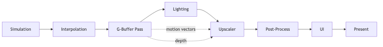

# Real-Time Rendering Pipeline Concepts

**Owen Newberry** · Learning with AI · Capstone support topic

---

## Why this matters for my project

Upscaling artifacts (ghosting, smearing, stutter) often trace back to **game code failing the pipeline’s contract** — not only “graphics bugs.”

My patterns (fixed timestep, motion authority, time-based effects) are meant to keep simulation and transforms aligned with what the **G-buffer and upscaler** expect each frame.

---

## The frame graph (render graph)

Modern engines don’t ad-hoc order passes. They build a **render graph** each frame:

- **Nodes** = render passes  
- **Edges** = buffer read/write dependencies  

The engine can insert barriers, cull unused work, and overlap CPU/GPU.  
**Implication:** If transforms update *after* the motion-vector pass, the upscaler sees stale vectors — ordering matters.

---

## G-buffer & deferred path (simplified)

1. **Geometry pass** — writes per-pixel data: albedo, normals, **depth**, **motion vectors**, material terms  
2. **Lighting** — full-screen, reads G-buffer  

**Motion vectors** are first-class G-buffer outputs: per-pixel screen-space motion since the last frame. The upscaler uses them to reproject history.

---

## When motion vectors lie

If **two systems** move the same object in one frame (single-writer violation), the transform used to draw may not match the transform used for motion vectors → **ghosting**.

---

## Camera jitter

TAA and temporal upscalers need **sub-pixel camera offsets** each frame (e.g. Halton sequences) to accumulate detail across frames.

**Game must:** apply jitter in projection, **remove jitter** from object motion so vectors reflect real motion, not wobble. Missing un-jitter → **flicker**.

---

## History buffers

The upscaler keeps a **reprojected** copy of the previous high-res result and blends with the current frame.

**Invalidate** when history is untrusted: scene cuts, teleports, disocclusion, some transparency/UI. Engines expose **reactive** / bias masks for this.

Non-deterministic simulation → history doesn’t line up → **trails and smear**.

---

## Depth buffer

Upscaling uses **depth** for occlusion, disocclusion, and blend weights. **Reversed-Z** (common in UE) improves precision. Bad depth at edges → **flicker** at boundaries.

---

## One frame, end to end (simplified)

1. Simulation (fixed timestep)  
2. Interpolation for render time  
3. Render graph build  
4. G-buffer (depth, **motion vectors**, …)  
5. Lighting at render resolution  
6. **Upscaler** (color + depth + motion + jitter → display-res)  
7. Post, UI, present  

My patterns map to steps **1, 2, and 4** especially.

---

## Takeaways

- The pipeline is a **contract** — break inputs or timing, break temporal reconstruction.  
- **Motion vectors** in the G-buffer are the main game-side lever for upscaler quality.  
- **Jitter** must be applied and then **accounted for** in motion.  
- **History** needs stable, predictable state — the same “predictability” theme as the capstone demos.

---

## Sources & notes

Deeper write-up: `capstone-research/renderingpipeline.md`  
*AI used as a research aid; concepts validated against engine/vendor docs.*
